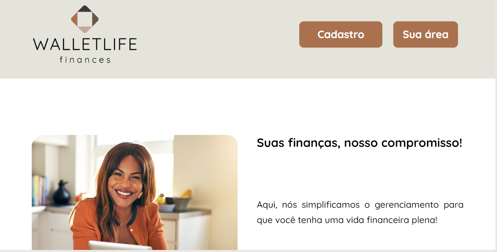

<h1 align="center">WALLETLIFE</h1>

<p align="center">
  Criação de uma aplicação para lidar com transações financeiras, aonde conseguimos adicionar, editar e deletar uma receita, despesa ou investimento.<br/>
</p>

<p align="center">
  <a href="#-tecnologias">Tecnologias</a>&nbsp;&nbsp;&nbsp;|&nbsp;&nbsp;&nbsp;
  <a href="#-sobre-o-projeto">Sobre o Projeto</a>&nbsp;&nbsp;&nbsp;
</p>

<p align="center">
  
</p>

<p align="center">
  <a href="https://wallet-life.vercel.app/" target="_blank">➡️ Acesse o deploy!</a>
</p>

## 🚀 Tecnologias

Esse projeto foi desenvolvido com as seguintes tecnologias:

- HTML 5
- Styled Components
- TypeScript
- React
- MUI
- Testing Library 

## ⚙️ Instalação do projeto

Passo-a-passo:

1. Comandos necessários para executar:

```
npm start
```

## 💻 Links úteis

- <a href="https://www.figma.com/file/MqXGtpJTpHLTWHNETwrfC1/Wallet-life?type=design&node-id=0-1&mode=design" target="_blank">➡️ Acesse o Figma!</a>
- <a href="https://trello.com/b/jjRiBxAh/kanban-wallet-life" target="_blank">➡️ Acesse o Trello!</a>
